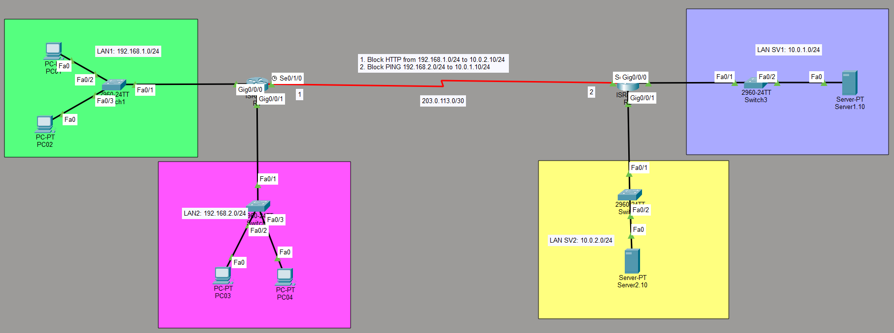

# Extended Access Control List (ACL) Configuration Lab

## Key Characteristics
* **Range:** Use the numbering range 100–199 and 2000–2699.
* **Placement:** Should be placed as close to the source of the traffic as possible to save bandwidth and router resources.
* **Implicit Deny:** Every ACL ends with an invisible deny ip any any. If traffic doesn't match a permit statement, it is dropped.

## Network Topology 
The network topology consists of two distinct sites connected via a Serial WAN connection using the subnet `203.0.113.0/30`.

Below is the network diagram for this lab setup:



### Network Segmentation

  | Segment | Network Address | Default Gateway | Attached Devices / Role |
| :--- | :--- | :--- | :--- |
| **LAN 1** | `192.168.1.0/24` | `192.168.1.1` | PC01, PC02 |
| **LAN 2** | `192.168.2.0/24` | `192.168.2.1` | PC03, PC04 |
| **WAN Link** | `203.0.113.0/30` | — | Serial Link (R1 $\leftrightarrow$ R2) |
| **SERVER 1** | `10.0.1.0/24` | `10.0.1.1` | Critical Server 1 |
| **SERVER 2** | `10.0.2.0/24` | `10.0.2.1` | Critical Server 2 |

## Project Overview
This repository contains a Cisco Packet Tracer laboratory focused on implementing **Extended Access Control Lists (ACLs)**. Unlike Standard ACLs, which only filter traffic based on the source IP address, Extended ACLs provide granular control by filtering traffic based on:
* Source and Destination IP addresses
* Protocols (IP, TCP, UDP, ICMP, etc.)
* Port numbers (e.g., HTTP Port 80)

## Lab Objectives & Traffic Requirements
The security policy demands traffic restriction between specific networks while keeping all other communication intact:

1. **Block HTTP Traffic:** Prevent all traffic originating from **LAN 1** (`192.168.1.0/24`) from reaching web services (HTTP / Port 80) on **LAN SV2** (`10.0.2.10/24`).
2. **Block PING Traffic:** Prevent all ICMP (Ping) traffic originating from **LAN 2** (`192.168.2.0/24`) from reaching **LAN SV1** (`10.0.1.10/24`).
3. **Permit All Other Traffic:** All other network segments must maintain seamless inter-VLAN and cross-WAN communication.


## Command Syntax
The general structure for an Extended ACL entry is:
**access-list [number] [permit|deny] [protocol] [source_address] [source_wildcard] [destination_address] [destination_wildcard] [operator] [port]**


## Configuration & Implementation

Extended ACLs should ideally be applied **as close to the source as possible** to prevent unwanted traffic from consuming network bandwidth across the WAN link.

### 1. Implementing ACL 101 (HTTP Restriction)
Applied on **Router 1** inbound on the `Gig0/0/0` interface:

```bash
R1(config)#ip access-list extended BLOCK_HTTP_LAN1_to_SERVER2
R1(config-ext-nacl)#deny tcp 192.168.1.0 0.0.0.255 host 10.0.2.10 eq 80
R1(config-ext-nacl)#permit ip any any

R1(config)#interface gigabitEthernet 0/0/0
R1(config-if)#ip access-group BLOCK_HTTP_LAN1_to_SERVER2 in
```
### 2. Implementing ACL 102 (ICMP Restriction)
Applied on Router 1 inbound on the `Gig0/0/1` interface:
```bash
R1(config)#ip access-list extended BLOCK_PING_LAN2_to_SERVER1
R1(config-ext-nacl)#deny icmp 192.168.2.0 0.0.0.255 host 10.0.1.10 echo
R1(config-ext-nacl)#permit ip any any

R1(config)#interface gigabitEthernet 0/0/1
R1(config-if)#ip access-group BLOCK_PING_LAN2_to_SERVER1 in
```

## Show Configuration
### Show Access List
```bash
R1#show ip access-lists 
Extended IP access list BLOCK_HTTP_LAN1_to_SERVER2
    10 deny tcp 192.168.1.0 0.0.0.255 host 10.0.2.10 eq www
    20 permit ip any any
Extended IP access list BLOCK_PING_LAN2_to_SERVER1
    10 deny icmp 192.168.2.0 0.0.0.255 host 10.0.1.10 echo
    20 permit ip any any
```
```bash
R1#show ip route 
Codes: L - local, C - connected, S - static, R - RIP, M - mobile, B - BGP
       D - EIGRP, EX - EIGRP external, O - OSPF, IA - OSPF inter area
       N1 - OSPF NSSA external type 1, N2 - OSPF NSSA external type 2
       E1 - OSPF external type 1, E2 - OSPF external type 2, E - EGP
       i - IS-IS, L1 - IS-IS level-1, L2 - IS-IS level-2, ia - IS-IS inter area
       * - candidate default, U - per-user static route, o - ODR
       P - periodic downloaded static route

Gateway of last resort is not set

     10.0.0.0/24 is subnetted, 2 subnets
S       10.0.1.0/24 [1/0] via 203.0.113.2
S       10.0.2.0/24 [1/0] via 203.0.113.2
     192.168.1.0/24 is variably subnetted, 2 subnets, 2 masks
C       192.168.1.0/24 is directly connected, GigabitEthernet0/0/0
L       192.168.1.1/32 is directly connected, GigabitEthernet0/0/0
     192.168.2.0/24 is variably subnetted, 2 subnets, 2 masks
C       192.168.2.0/24 is directly connected, GigabitEthernet0/0/1
L       192.168.2.1/32 is directly connected, GigabitEthernet0/0/1
     203.0.113.0/24 is variably subnetted, 2 subnets, 2 masks
C       203.0.113.0/30 is directly connected, Serial0/1/0
L       203.0.113.1/32 is directly connected, Serial0/1/0
```